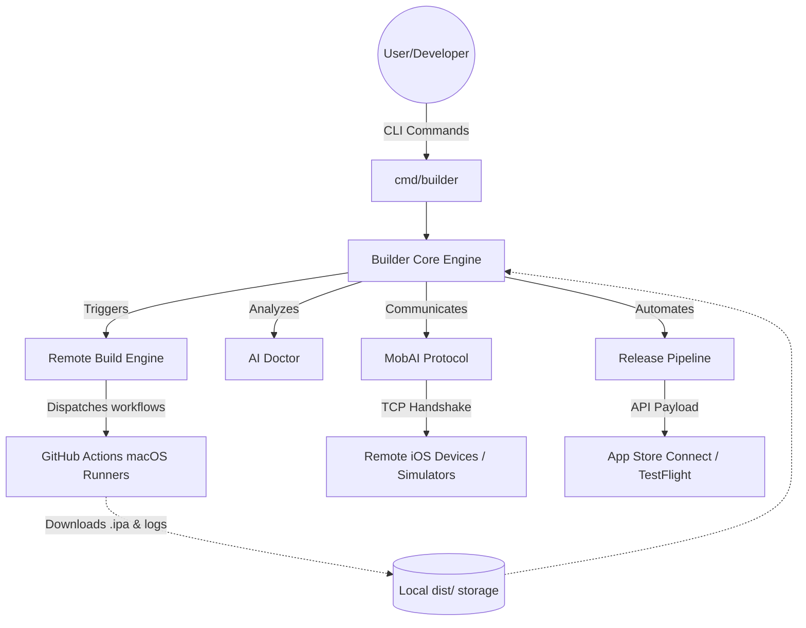

<div align="center">

# 🚀 BUILDER CLI
### Industrial-Grade iOS Delivery from Anywhere

<p align="center">
  <b>The ultimate CLI toolchain that democratizes iOS development by eliminating the "Mac Tax".</b><br>
  Build, test, sign, and release native iOS, Flutter, and React Native applications from Windows, Linux, or WSL.
</p>

[](LICENSE)
[](go.mod)
[](docs/DESIGN.md)
[](#)
[](CONTRIBUTING.md)

---
</div>

## 📖 Table of Contents

1. [🛑 The Problem: The "Mac Tax"](#-the-problem-the-mac-tax)
2. [💡 The Solution: Builder CLI](#-the-solution-builder-cli)
3. [✨ Key Features](#-key-features)
4. [🏗️ Architectural Deep Dive](#️-architectural-deep-dive)
5. [📦 Installation & Setup](#-installation--setup)
6. [🚦 Comprehensive Quick Start](#-comprehensive-quick-start)
7. [💻 Supported Frameworks](#-supported-frameworks)
8. [⚙️ Configuration (`builder.json`)](#️-configuration-builderjson)
9. [🤖 The AI Doctor](#-the-ai-doctor)
10. [📱 MobAI Protocol](#-mobai-protocol)
11. [🛠️ Detailed Command Reference](#️-detailed-command-reference)
12. [📂 Codebase Structure](#-codebase-structure)
13. [🗺️ Roadmap](#️-roadmap)
14. [🤝 Contributing & Community](#-contributing--community)
15. [❓ FAQ](#-faq)
16. [📄 License](#-license)

---

## 🛑 The Problem: The "Mac Tax"

Historically, iOS development has been heavily gatekept by a significant hardware requirement: **you must own an Apple Mac computer to compile iOS applications.**

This restriction creates immense friction and costs for:
- **Cross-Platform Developers:** Engineers using Flutter, React Native, or Unity on Windows or Linux environments are forced to buy expensive secondary machines.
- **Open-Source Contributors:** Developers wishing to submit patches or test iOS builds for open-source projects are completely blocked without Apple hardware.
- **CI/CD Infrastructure Teams:** Organizations are forced to manage complex code-signing setups and pay premium rates for specialized macOS CI/CD runners, rather than using standard Linux containers.

Beyond the hardware limitation, iOS build failures are notoriously cryptic. When a build breaks due to `ERR_SEC_INTERNAL_COMPONENT`, dependency conflicts, or provisioning profile mismatches, developers lose hours deciphering logs.

## 💡 The Solution: Builder CLI

**Builder CLI** completely shatters these barriers. It is a high-performance, cleanly-architected open-source Go application that seamlessly orchestrates remote macOS build environments (leveraging GitHub Actions) directly from your local terminal.

But Builder is far more than just a remote execution tool. It acts as your **intelligent pair-programmer** and **remote device manager**:
- **AI Doctor:** Diagnoses and auto-fixes cryptic build logs using heuristics and LLM logic.
- **MobAI Protocol:** Connects your local terminal to remote real devices or simulators for Hot Reload and active debugging.
- **Release Automation:** Automates the entire TestFlight and App Store Connect pipeline.

---

## ✨ Key Features

| Feature | Description |
| :--- | :--- |
| 🌍 **Zero macOS Required** | Compile native `.ipa` and `.app` files directly from Windows, Linux, or WSL using remote GitHub Actions runners, entirely controlled from your local CLI. |
| 🤖 **AI Doctor Diagnostics** | Automatically analyzes thousands of lines of verbose build logs to pinpoint root causes (provisioning, network, dependencies) and applies instant auto-fixes. |
| 📱 **MobAI Remote Protocol** | A high-performance TCP-based interaction layer that allows you to connect to remote iPhones or Mac Simulators for Hot Reload, log streaming, and visual debugging. |
| 🚀 **Universal Framework Support** | First-class, out-of-the-box support with automatic project detection for **Xcode (Swift/Obj-C)**, **Flutter**, and **React Native**. |
| 🔐 **Automated Code Signing** | Validates, decrypts, and manages Apple Team IDs, Certificates (`.p12`), and Provisioning Profiles without needing to manually touch Xcode settings. |
| 🚢 **TestFlight & App Store CI/CD** | Direct integration with the App Store Connect API for automated application distribution, tester management, and dynamic release note generation. |

---

## 🏗️ Architectural Deep Dive

Builder is strictly designed using **Clean Architecture** principles in Go. The domain logic is completely decoupled from external APIs, ensuring maximum maintainability and testability.



*For an extensive breakdown of the internal sub-modules (`internal/build`, `internal/ai`, `internal/mobai`), check out the [Design Documentation](docs/DESIGN.md).*

---

## 📦 Installation & Setup

### Prerequisites
- [Go 1.25+](https://go.dev/dl/) installed on your machine.
- Git CLI.
- A GitHub Account (for remote runner orchestration).

### Method 1: Using `go install` (Recommended)
The fastest way to install the CLI globally:
```bash
go install github.com/kanjariyaraj/Builder/cmd/builder@latest
```

### Method 2: Build from Source
If you wish to contribute or run the bleeding-edge `main` branch:
```bash
# 1. Clone the repository
git clone https://github.com/kanjariyaraj/Builder.git
cd Builder

# 2. Build the binary using Make
make build

# 3. Move the binary to your system PATH
sudo mv builder /usr/local/bin/

# 4. Verify installation
builder version
```

---

## 🚦 Comprehensive Quick Start

Experience the full power of Builder in your project repository by following these 5 steps:

### 1. Initialize the Project Configuration
Navigate to your existing iOS, Flutter, or React Native project root directory and run:
```bash
builder config init
```
*This detects your tech stack and generates an optimized `builder.json` file.*

### 2. Securely Authenticate
Builder uses GitHub Actions as its secure remote execution environment.
```bash
builder auth github
```
*Follow the secure OAuth device-flow prompt in your browser to link your account. Credentials are saved locally.*

### 3. Connect to your Repository
Link your local directory to the remote GitHub repository where the runners will execute:
```bash
builder repo connect
```

### 4. Run the AI System Audit
Ensure your environment, Apple code-signing certificates, and internal configurations are perfectly healthy before wasting minutes on a broken build:
```bash
builder doctor
```

### 5. Trigger the Remote Build
Kick off the build process. Builder will dispatch the remote runner and stream the live logs directly to your local terminal.
```bash
builder build run --wait --logs
```
*Once finished, your compiled `.ipa` file will be automatically downloaded to the `./dist` folder!*

---

## 💻 Supported Frameworks

Builder automatically detects your tech stack, injects the correct CI/CD workflow templates (located in `templates/`), and manages framework-specific features.

<details>
<summary><strong>🔵 Flutter Support</strong></summary>
<br>
Builder offers a highly optimized Flutter experience, bridging remote iOS simulators directly to your local Dart VM.

```bash
# Start a full development session with seamless Hot Reload
builder flutter dev

# Attach to an already running remote session
builder flutter attach

# Verify local and remote Flutter configurations
builder flutter doctor
```
*Read the [Flutter Development Deep Dive](docs/flutter-dev.md).*
</details>

<details>
<summary><strong>⚛️ React Native Support</strong></summary>
<br>
Builder manages the Node.js Metro bundler and Fast Refresh triggers over the MobAI TCP tunnel.

```bash
# Start the Metro bundler and launch the dev session
builder rn dev

# Manually trigger Fast Refresh
builder rn reload

# Stream remote device logs locally
builder rn logs
```
*Read the [React Native Development Deep Dive](docs/react-native-dev.md).*
</details>

<details>
<summary><strong>🛠️ Native iOS (Xcode)</strong></summary>
<br>
Standard Swift, Objective-C, and SwiftUI projects are supported out of the box. Builder features intelligent Xcode Workspace and Scheme detection, handling `.xcodeproj` and `.xcworkspace` complexities seamlessly.
</details>

---

## ⚙️ Configuration (`builder.json`)

Your project is driven by the `builder.json` file. Here is an overview of the core schema:

```json
{
  "project_name": "MyAwesomeApp",
  "repository": "https://github.com/myorg/my-awesome-app.git",
  "ios": {
    "minimum_version": "15.0",
    "target_version": "17.0"
  },
  "signing": {
    "team_id": "XXXXXXXXXX",
    "provisioning_profile": "certs/App_Profile.mobileprovision",
    "certificate": "certs/App_Cert.p12"
  },
  "mobai": {
    "host": "remote-mac.local",
    "port": 12345,
    "auto_reconnect": true
  },
  "ai": {
    "enabled": true,
    "auto_fix": true
  }
}
```
*To securely inject secrets via CI environments, see the provided `.env.example` file.*

---

## 🤖 The AI Doctor

Unlike standard CLI tools that throw an error and exit, Builder attempts to heal itself. The AI Doctor (`internal/ai`) parses raw `xcodebuild` stdout/stderr. 

**How it works:**
1. Uses regex and error classifiers to parse out build noise.
2. Cross-references errors against a curated internal Knowledge Base (`knowledgebase.go`).
3. If heuristics fail, it can connect to an external LLM to generate actionable, context-aware fixes.
4. With `--auto-fix`, it can automatically patch `Podfile` versions, update `Info.plist` configurations, or adjust dependency matrices.

---

## 📱 MobAI Protocol

MobAI (`internal/mobai`) is our proprietary high-performance interaction layer for remote iOS device management.

**Core Capabilities:**
- Establishes a persistent, self-healing TCP tunnel to a remote macOS agent.
- Streams live iOS syslog and application output locally.
- Installs `.ipa` files directly to remote hardware without needing Apple Configurator.
- Broadcasts UI screenshots back to your local terminal.

---

## 🛠️ Detailed Command Reference

Builder offers an extensive API via its CLI. Use `builder [command] --help` for specific flags.

| Subcommand | Action | Description |
|:---|:---|:---|
| `builder doctor` | **Audit** | Performs a 360° health check on your system, dependencies, configs, and signing assets. |
| `builder auth` | **Setup** | Authenticate with GitHub (`github`), check `status`, or `logout`. |
| `builder config` | **Setup** | `init`, `show`, or `validate` your `builder.json` manifest. |
| `builder repo` | **Info** | `connect`, `validate`, or inspect `info` regarding your remote Git link. |
| `builder build` | **Execution** | `run` a remote build, stream a `log`, check `status`, or download `artifacts`. |
| `builder ai` | **Diagnostics**| Run `fix` to let the AI automatically resolve build failures based on recent logs. |
| `builder device` | **MobAI** | `list`, `info`, `install`, `launch`, or read `logs` from connected MobAI devices. |
| `builder release`| **Delivery** | `deploy` to TestFlight, manage beta `groups`, and automate `notes`. |

---

## 📂 Codebase Structure

For architecture enthusiasts and contributors, here is how the codebase is organized:

```text
Builder/
├── cmd/builder/          # Entry points and Cobra CLI commands
├── internal/             # Core business logic (Clean Architecture)
│   ├── ai/               # AI Doctor log analysis & auto-fix logic
│   ├── build/            # Remote runner orchestration & log streaming
│   ├── flutter/          # Flutter dev tools, hot-reload, logs
│   ├── mobai/            # TCP-based remote device protocol
│   ├── releasepipeline/  # Full CI/CD TestFlight automation
│   └── signing/          # Apple Certificate & Profile validation
├── docs/                 # Extensive architectural and usage guides
├── templates/            # GitHub Actions CI workflow templates
├── builder.json          # Core project configuration schema
├── .env.example          # Template for CI environment variables
└── Makefile              # Build automation (lint, test, build)
```

---

## 🗺️ Roadmap

Builder is constantly evolving to make remote development even better.

- [x] **Phase 1-4**: Core CLI Framework, GitHub Auth, Workflow Generation
- [x] **Phase 5-10**: Build Engine, Artifact Management, AI Diagnostics
- [x] **Phase 11-12**: TestFlight Integration, Release Pipelines
- [ ] **Phase 13**: App Store Connect Automated Screenshotting & Metadata Management
- [ ] **Phase 14**: Local Build Engine Support (For developers with Macs who want the AI & Pipeline tools locally)
- [ ] **Phase 15**: A localized Web Dashboard for visual, real-time pipeline tracking.

---

## 🤝 Contributing & Community

Builder is built **by** the developer community, **for** the developer community. We heartily welcome issues, feature requests, and pull requests!

1. Fork the Project.
2. Create your Feature Branch (`git checkout -b feat/YourAmazingFeature`).
3. Commit your Changes (`git commit -m 'feat: Add YourAmazingFeature'`).
4. Push to the Branch (`git push origin feat/YourAmazingFeature`).
5. Open a Pull Request.

Please review our [CONTRIBUTING.md](CONTRIBUTING.md) for detailed guidelines, and our [CODE_OF_CONDUCT.md](CODE_OF_CONDUCT.md) to ensure a welcoming environment for everyone.

---

## ❓ FAQ

**Q: Do I need a paid Apple Developer Account to use Builder?**<br>
A: Yes and No. To distribute applications via TestFlight or the App Store, Apple strictly requires a paid developer account. However, Builder fully supports generating unsigned or ad-hoc builds for testing in simulators without a paid account.

**Q: Does Builder cost money to use?**<br>
A: **Builder CLI is 100% free and open-source.** However, it utilizes GitHub Actions for remote macOS builds. GitHub provides a generous free tier for public repositories, but if you are working on a private repository, you are limited to a finite number of free macOS runner minutes per month provided by GitHub.

**Q: How does the AI Doctor protect my code?**<br>
A: The AI Doctor primarily relies on its local `knowledgebase.go` to parse standard iOS compilation errors without sending your code anywhere. If an external LLM is enabled in the config, only the explicit compiler error logs (not your source code) are securely transmitted for analysis.

**Q: Is there an Enterprise version available?**<br>
A: Not currently. Builder is completely open-source. For self-hosted enterprise setups, you simply configure Builder to point toward your own self-hosted GitHub macOS runners.

---

## 📄 License

This project is licensed and distributed under the MIT License. See the [LICENSE](LICENSE) file for more information.

---

<p align="center">
  <b>Built with ❤️ by <a href="https://github.com/kanjariyaraj">Kanjariya Raj</a> and Contributors</b><br>
  <i>Empowering developers to build for iOS from anywhere.</i>
</p>
