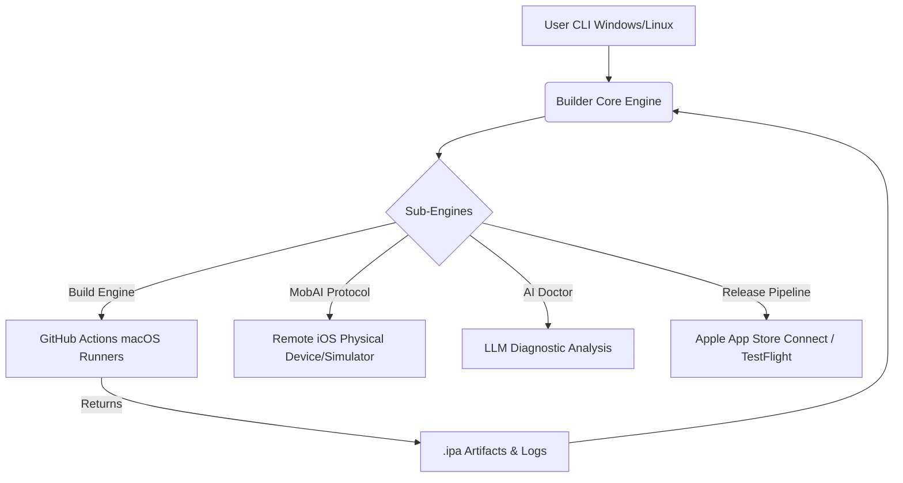

<div align="center">
  

  # 🚀 Builder: Industrial-Grade iOS Delivery from Anywhere

  **The ultimate CLI toolchain that democratizes iOS development by eliminating the "Mac Tax".**<br>
  Build, test, sign, and release native iOS, Flutter, and React Native applications from Windows, Linux, or WSL.

  [](LICENSE)
  [](go.mod)
  [](docs/DESIGN.md)
  [](.github/workflows/ci.yml)
  [](https://goreportcard.com/report/github.com/kanjariyaraj/Builder)
  [](CONTRIBUTING.md)

</div>

---

## 📖 Table of Contents

- [The Problem](#-the-problem-the-mac-tax)
- [The Solution](#-the-solution-builder-cli)
- [✨ Key Features](#-key-features)
- [🏗️ Architectural Overview](#️-architectural-overview)
- [📦 Installation](#-installation)
- [🚦 Quick Start Guide](#-quick-start-guide)
- [💻 Supported Frameworks](#-supported-frameworks)
- [🛠️ Detailed Usage & Commands](#️-detailed-usage--commands)
- [📂 Project Structure](#-project-structure)
- [🗺️ Roadmap](#️-roadmap)
- [🤝 Contributing](#-contributing)
- [❓ FAQ](#-faq)
- [📄 License](#-license)

---

## 🛑 The Problem: The "Mac Tax"

Historically, iOS development has been gatekept by a significant hardware requirement: **you must own a Mac to compile iOS applications.**
This creates friction for:
- **Cross-platform developers** (Flutter, React Native) working on Windows or Linux.
- **Open-source contributors** who want to test iOS builds without investing in Apple hardware.
- **CI/CD Pipelines** that require complex code-signing setups and expensive macOS runners.

Additionally, when iOS builds fail, the logs are notoriously cryptic, often involving obscure code-signing errors (`ERR_SEC_INTERNAL_COMPONENT`), dependency conflicts, or missing provisioning profiles.

## 💡 The Solution: Builder CLI

**Builder** shatters these barriers. It is a high-performance, open-source Go CLI that seamlessly orchestrates remote macOS build environments (via GitHub Actions) directly from your local terminal.

But it doesn't stop at building. Builder acts as an **intelligent pair-programmer** and **device manager**, integrating an **AI Doctor** to diagnose and auto-fix cryptic build logs, and the **MobAI Protocol** to interact with remote real devices or simulators.

---

## ✨ Key Features

| Feature | Description |
| :--- | :--- |
| 🌍 **Zero macOS Required** | Compile native `.ipa` files directly from Windows, Linux, or WSL using remote GitHub Actions runners. |
| 🤖 **AI Doctor Diagnostics** | Automatically analyzes thousands of lines of build logs to identify root causes (provisioning, dependencies) and applies auto-fixes. |
| 📱 **MobAI Remote Protocol** | A TCP-based interaction layer that allows you to connect to remote iPhones/Simulators for Hot Reload, log streaming, and debugging. |
| 🚀 **Universal Framework Support** | First-class, out-of-the-box support for **Xcode (Swift/Obj-C)**, **Flutter**, and **React Native**. |
| 🔐 **Automated Code Signing** | Validates and manages Apple Team IDs, Certificates (`.p12`), and Provisioning Profiles without touching Xcode. |
| 🚢 **Release Pipeline Automation** | Direct integration with **TestFlight** and **App Store Connect** for automated distribution and release note generation. |

---

## 🏗️ Architectural Overview

Builder is designed using **Clean Architecture** principles in Go, ensuring modularity, testability, and high performance.



*For a deeper dive into the architecture, check out our [Design Documentation](docs/DESIGN.md).*

---

## 📦 Installation

### Prerequisites
- [Go 1.25+](https://go.dev/dl/)
- Git installed on your system.

### Option 1: Via Go Install (Recommended)
```bash
go install github.com/kanjariyaraj/Builder/cmd/builder@latest
```

### Option 2: Build from Source
```bash
git clone https://github.com/kanjariyaraj/Builder.git
cd Builder
make build
# Move the binary to your PATH
sudo mv builder /usr/local/bin/
```

### Verify Installation
```bash
builder version
```

---

## 🚦 Quick Start Guide

Experience the full power of Builder in 5 simple steps:

### 1. Initialize Project Config
Navigate to your iOS, Flutter, or React Native project root and run:
```bash
builder config init
```
*This generates a `builder.json` file tailored to your project's framework.*

### 2. Authenticate with GitHub
Builder uses GitHub Actions as its remote execution environment.
```bash
builder auth github
```
*Follow the secure device-flow prompt to link your account.*

### 3. Connect Repository
Link your local directory to your remote GitHub repository:
```bash
builder repo connect
```

### 4. Run the AI Doctor
Ensure your environment, certificates, and configurations are perfectly healthy before building:
```bash
builder doctor
```

### 5. Trigger Remote Build
Kick off the build process. Builder will stream the logs directly to your terminal.
```bash
builder build run --wait --logs
```
*Once finished, your `.ipa` file will be downloaded automatically!*

---

## 💻 Supported Frameworks

Builder automatically detects your stack and configures the workflow.

<details>
<summary><strong>🔵 Flutter</strong></summary>
<br>
Supports seamless Hot Reload and auto-attach on remote devices.

```bash
# Start a full development session with Hot Reload
builder flutter dev

# Attach to a running session
builder flutter attach
```
Read the [Flutter Development Guide](docs/flutter-dev.md).
</details>

<details>
<summary><strong>⚛️ React Native</strong></summary>
<br>
Manages Metro bundler, Fast Refresh, and device log streaming remotely.

```bash
# Start Metro and dev session
builder rn dev

# Manually trigger Fast Refresh
builder rn reload
```
Read the [React Native Development Guide](docs/react-native-dev.md).
</details>

<details>
<summary><strong>🛠️ Native iOS (Xcode)</strong></summary>
<br>
Standard Swift/Objective-C projects are supported out of the box with intelligent scheme detection and provisioning profile management.
</details>

---

## 🛠️ Detailed Usage & Commands

Builder has a rich, intuitive command-line interface. Use `builder --help` to explore.

| Category | Command | Description |
|:---|:---|:---|
| **System** | `builder doctor` | Comprehensive audit of local deps, configs, and signing certificates. |
| **Auth** | `builder auth github` | Authenticate with GitHub securely. |
| **Config** | `builder config validate` | Deep-checks the `builder.json` integrity. |
| **Build** | `builder build run` | Trigger and stream a remote iOS build workflow. |
| | `builder build artifacts` | List and download generated `.ipa` files and reports. |
| **AI** | `builder ai fix` | Automatically analyze failed build logs and suggest/apply fixes. |
| **Devices** | `builder device install` | Install an `.ipa` directly to a connected remote/local device via MobAI. |
| **Release** | `builder release deploy` | Automate upload to TestFlight and generate release notes. |

*For a full walkthrough, see the [Execution Guide](docs/RUN_GUIDE.md).*

---

## 📂 Project Structure

For developers looking to contribute, here is how the codebase is organized:

```text
Builder/
├── cmd/builder/          # Entry points and Cobra CLI commands
├── internal/             # Core business logic (Clean Architecture)
│   ├── ai/               # AI Doctor log analysis & auto-fix logic
│   ├── build/            # Remote runner orchestration & log streaming
│   ├── flutter/          # Flutter dev tools, hot-reload, logs
│   ├── mobai/            # TCP-based remote device protocol
│   ├── releasepipeline/  # Full CI/CD TestFlight automation
│   └── signing/          # Apple Certificate & Profile validation
├── docs/                 # Extensive architectural and usage guides
├── templates/            # GitHub Actions CI workflow templates
├── builder.json          # Core project configuration schema
└── Makefile              # Build automation (lint, test, build)
```

---

## 🗺️ Roadmap

We are constantly evolving. Here's what's next:

- [x] **Phase 1-4**: Core CLI Framework, GitHub Auth, Workflow Generation
- [x] **Phase 5-10**: Build Engine, Artifact Management, AI Diagnostics
- [x] **Phase 11-12**: TestFlight Integration, Release Pipelines
- [ ] **Phase 13**: App Store Connect Automated Screenshotting & Metadata Management
- [ ] **Phase 14**: Local Build Engine Support (for users who actually own Macs but want the AI toolchain)
- [ ] **Phase 15**: Web Dashboard for visual pipeline tracking

---

## 🤝 Contributing

Builder is built by the community, for the community. We'd love your help!

1. Fork the Project
2. Create your Feature Branch (`git checkout -b feat/AmazingFeature`)
3. Commit your Changes (`git commit -m 'feat: Add some AmazingFeature'`)
4. Push to the Branch (`git push origin feat/AmazingFeature`)
5. Open a Pull Request

Please read our [CONTRIBUTING.md](CONTRIBUTING.md) and [CODE_OF_CONDUCT.md](CODE_OF_CONDUCT.md) for details on our code of conduct and the process for submitting pull requests.

---

## ❓ FAQ

**Q: Do I need a paid Apple Developer Account?**<br>
A: Yes, to distribute via TestFlight or the App Store, Apple requires a paid developer account. However, you can build unsigned or ad-hoc builds for testing without one.

**Q: Does Builder cost money to use?**<br>
A: Builder CLI is 100% free and open-source. However, it utilizes GitHub Actions for remote builds. GitHub provides a generous free tier for public repositories, but private repositories have a finite number of free macOS runner minutes per month.

**Q: How does the AI Doctor work?**<br>
A: It parses the raw stdout/stderr from `xcodebuild` or `flutter build`, cross-references it against our curated `internal/ai/knowledgebase.go` of common iOS errors, and uses heuristics (or an optional external LLM API if configured) to generate an actionable fix.

---

## 📄 License

Distributed under the MIT License. See [LICENSE](LICENSE) for more information.

---

<p align="center">
  <b>Built with ❤️ by <a href="https://github.com/kanjariyaraj">Kanjariya Raj</a> and Contributors</b><br>
  <i>Empowering developers to build for iOS from anywhere.</i>
</p>
